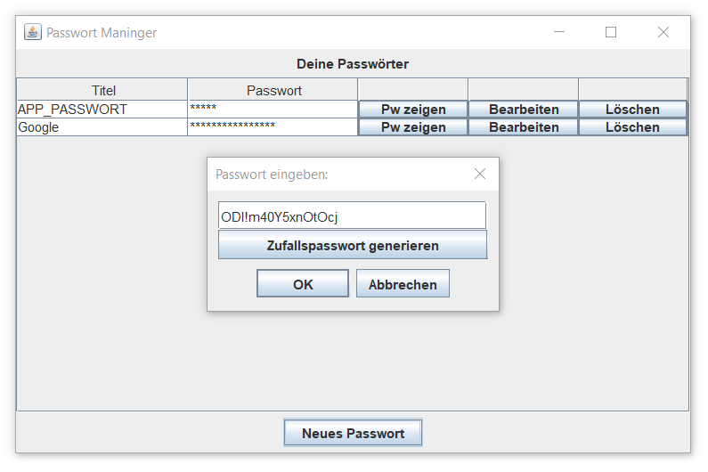

# Password Manager

Der **Password Manager** unterstützt Sie bei der sicheren Verwaltung Ihrer Passwörter. Bei der ersten Verwendung müssen Sie ein Administratorpasswort festlegen. Erst nach erfolgreicher Eingabe dieses Passworts erhalten Sie Zugriff auf Ihre gespeicherten Passwörter.

## Informationen
Dieses Projekt wurde im Rahmen einer achtstündigen Projektarbeit entwickelt.

## Screenshots


## Systemanforderungen 🔧
Um diese Anwendung auszuführen, benötigen Sie mindestens JDK 20 oder eine neuere Version.

## Installation 🔌
Befolgen Sie diese Schritte, um die Anwendung auf Ihrem lokalen System zu installieren:

1. Laden Sie die Repository-Daten herunter, indem Sie den folgenden Befehl ausführen:
   ```shell
   git clone https://github.com/mikework24/PasswortManninger.git
   ```

2. Öffnen Sie das Projekt in IntelliJ IDEA oder einer anderen geeigneten Entwicklungsumgebung.

3. Starten Sie die Anwendung.